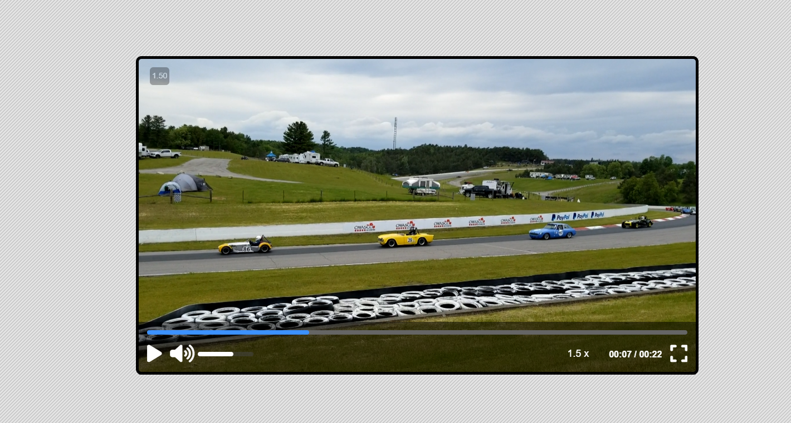

# Custom Video Player

A fully functional custom **Video Player** built using **HTML**, **CSS**, and **Vanilla JavaScript** — with controls like play/pause, volume control, progress bar control, and fullscreen support.

---
## Features

- Play / Pause toggle
- Volume and mute control
- Progress bar with scrub (click & drag to seek)
- ⛶ Fullscreen toggle
- Display of current time and duration

- - - - 
## How It Works

- The video element is controlled using custom HTML buttons and sliders.
- JavaScript connects the buttons and sliders to the video API:
    - `video.play()`, `video.pause()`
    - `video.currentTime`
    - `video.volume`
    - `video.requestFullscreen()`, etc.
- Progress bar updates automatically as video plays, and is clickable to seek.
- Event listeners handle time updates, button clicks, and input changes.
---
## Technologies Used

- **HTML5** – video element and controls layout
- **CSS3** – custom styling and responsive design
- **JavaScript (ES6)** – video API and user interactions

---
## Preview

[Demo](https://abdo-rabea.github.io/video-player/)

---
## 📄 License

This project is open-source and free to use for learning or personal projects.
